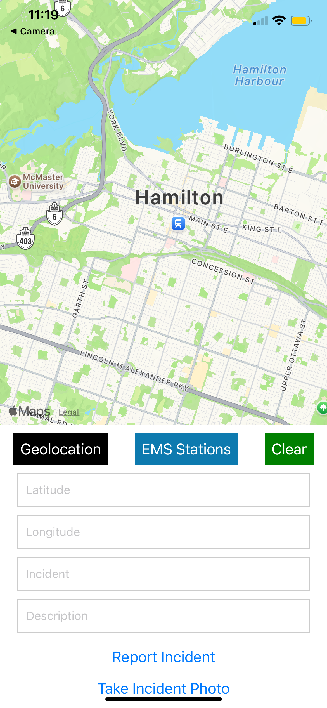
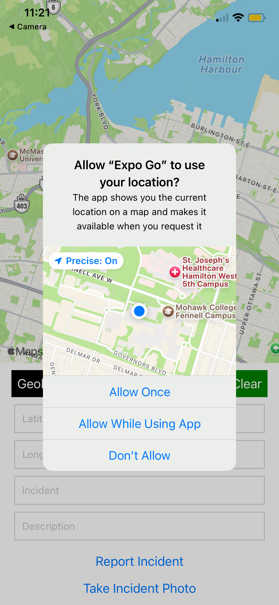
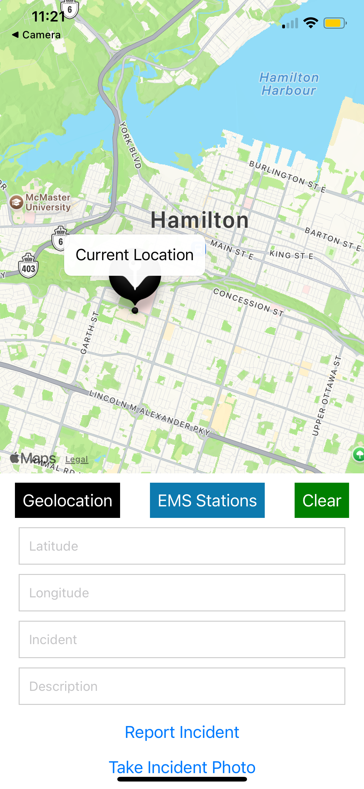
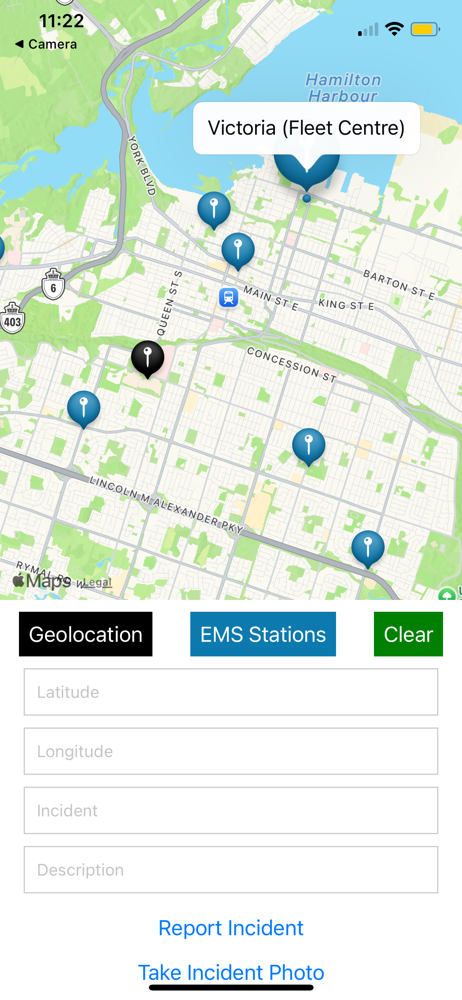
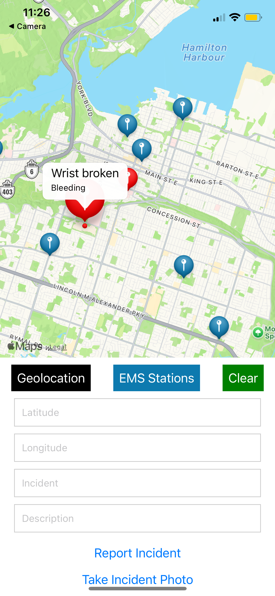
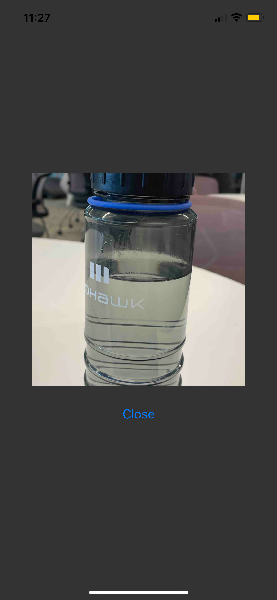

# Sample Snack app

Open the `App.js` file to start writing some code. You can preview the changes directly on your phone or tablet by scanning the **QR code** or use the iOS or Android emulators. When you're done, click **Save** and share the link!

When you're ready to see everything that Expo provides (or if you want to use your own editor) you can **Download** your project and use it with [expo cli](https://docs.expo.dev/get-started/installation/#expo-cli)).

All projects created in Snack are publicly available, so you can easily share the link to this project via link, or embed it on a web page with the `<>` button.

If you're having problems, you can tweet to us [@expo](https://twitter.com/expo) or ask in our [forums](https://forums.expo.dev/c/expo-dev-tools/61) or [Discord](https://chat.expo.dev/).

Snack is Open Source. You can find the code on the [GitHub repo](https://github.com/expo/snack).

# EMS-Reporting-

# App Demo

1. Step 1: App interface when first opened

   

2. Step 2: Click Geolocation button, will ask for location sharing permission

   

3. Step 3: After permission allowed

   

4. Step 4: Click EMS Stations button will appear all available EMS Stations in Hamilton, ON

   

5. Step 5: Enter Latitude, Longitude, Incident and Description, without taking incident photo and Click 'Report Incident'

   

6. Step 6: Now re-enter new Latitude, Longitude, Incident, Description then Click 'Take Incident Photo'. Camera Interface will appear

   

7. Step 7: Take an incidentphoto (Demo of a water bottle). Then Click 'Close' to close camera and Click 'Report Incident'

   

Now try clicking on the marker again to show the inident photo we just took

   
